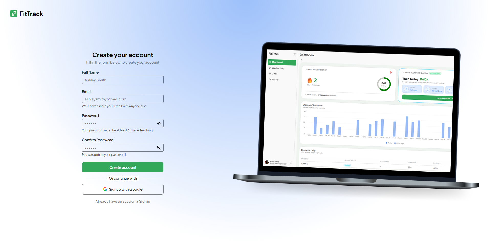

# FitTrack

---

## Description

A full-stack fitness tracking application built with Nextjs 16, React and Typescript. It supports user authentication, tracking your daily fitness, setting weekly goals and much more.

## Features

- User authentication (Email/Password + Google sign-in)
- Secure login using OAuth 2.0
- Streak and workout recommendation based on muscle group
- Dark/Light mode
- Save Workout you like

## Tech Stack

### Frontend:

- Next.js 16 (App Router)
- React 19
- Tailwind CSS
- Typescript
- shadcn/ui (component library)
- Radix UI (accessible primitives)

### State Management

- Zustand (client state management)

### Backend/Server

- Neon Database (serverless PostgreSQL)
- Drizzle ORM (type-safe database queries)

### Forms & Validation

- React Hook Form (form handling)
- Zod (schema validation)

### UI/UX Enhancements

- Lucide React (icons)
- Sonner (toast notifications)
- Recharts (data visualization)

### Utilities

- clsx & tailwind-merge (conditional styling)
- date-fns (date utilities)
- dotenv (environment variables)

## Installation

### 1. Clone the repository

git clone https://github.com/AnishGane/FitTrack

### 2. Navigate to project

cd FitTrack

### 3. Install dependencies

npm install

## Environment Variables

Create a `.env` file in the server folder and add the variable accordingly, specified in `.env.example`.

## Run Locally

```
pnpm dev
or
npm run dev
```

## Screenshots

